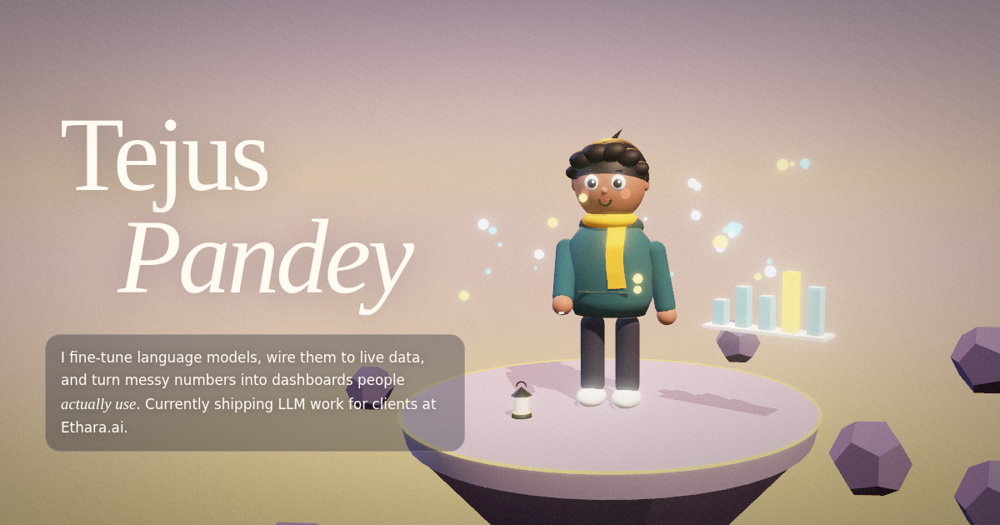

# Tejus Pandey · 3D Portfolio

A scroll-driven 3D portfolio built with three.js and custom GLSL shaders. My character lives on a floating island; scrolling flies the camera through my story, and you can ask him anything about my work.



## What's inside

- **Scroll-scrubbed camera.** Each timeline entry has its own camera pose; scrolling blends between them with a short pause at every stop.
- **Ask me anything.** A chat that answers from my resume. On claude.ai it uses live Claude answers; everywhere else it uses instant built-in answers.
- **Skill tokens.** Seventeen glowing icon badges, one for each of my real skills (Git, Docker, Python, SQL, Power BI and more). Hover one to see its name, click it to ask about it, and when you ask about a skill in the chat its icon flies in front of me.
- **A loading screen worth watching.** Glowing tokens swirl into orbit rings as the site loads, follow your cursor and burst into sparks when you click, while status lines like "Containerising the clouds" type out. At 100% everything collapses into a flash and a circle opens onto the island.
- **A character that feels alive.** Eyes follow your cursor, he blinks and breathes, waves, jumps or spins when clicked, checks his phone when you go idle, and yawns and lights a lantern in night mode.
- **Real numbers.** The floating chart rises to my actual project results at the 2024 stop.
- **Custom GLSL.** A wind shader moves the hair and scarf, the sky is a gradient shader, and a final pass adds tone mapping, film grain and a vignette. Depth of field refocuses per shot, and bloom makes the tokens and lantern glow.
- **Details.** Glassmorphism UI, light and dark themes, a calm ambient score generated live with the Web Audio API: a slow pad, wind, wind chimes and crickets at night (off by default), a custom cursor, phone-tilt parallax on mobile, a warp-speed jump into the Orbit project and a hidden easter egg (type `hire`).

## Tech

three.js r147 · GLSL · WebGL post-processing (bokeh, bloom) · Web Audio API · vanilla JavaScript · one HTML file, no build step.

## Run locally

Open `index.html` in a browser, or serve the folder:

```bash
npx serve .
```

## Deploy on GitHub Pages (free)

1. Create a repository (for example `portfolio`) and upload `index.html`, `og-image.png` and this `README.md`.
2. In the repository, open **Settings → Pages**, set **Source** to *Deploy from a branch*, choose `main` and `/ (root)`, and save.
3. After a minute your site is live at `https://tejus2310.github.io/portfolio/`.

## Use your own domain (for example tejuspandey.dev)

1. Buy the domain from any registrar (Namecheap, Cloudflare, GoDaddy).
2. In **Settings → Pages → Custom domain**, enter the domain and save.
3. At your registrar, add the DNS records GitHub shows (four `A` records for the root domain, or a `CNAME` pointing to `tejus2310.github.io` for `www`).
4. Tick **Enforce HTTPS** once it's available.

## Make link previews work (LinkedIn, WhatsApp, X)

In `index.html`, change the two `og-image.png` values to the full address of the image, for example:

```html
<meta property="og:image" content="https://tejuspandey.dev/og-image.png" />
<meta name="twitter:image" content="https://tejuspandey.dev/og-image.png" />
```

Then check it with LinkedIn's Post Inspector: https://www.linkedin.com/post-inspector/

## Record a 30-second demo for LinkedIn

1. Open the site full screen in Chrome on a good monitor.
2. Record with QuickTime (Mac: File → New Screen Recording) or OBS.
3. Show, in order: the hero, a slow scroll through the timeline, clicking the character, asking the chat "Do you know Docker?", switching to night mode, and the Orbit warp.
4. Keep it under 30 seconds, export at 1080p, and post it with a link to the site.

## License

Code: MIT. The character, name, resume content and images are personal and not covered by the license.
